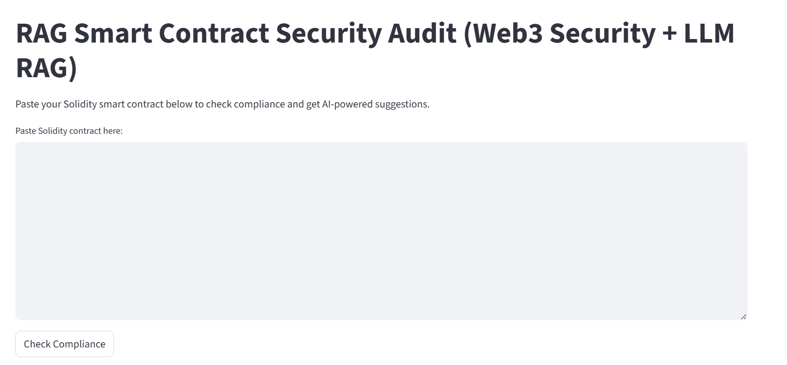

# RAG Smart Contract Security Audit (Smart Contract Security Audit + LLM RAG)


A production-ready, AI-powered tool that uses **RAG (Retrieval-Augmented Generation)** to analyze Solidity smart contracts for compliance, security, and upgradeability.

>  Built with LangChain + ChromaDB + Hugging Face
>  Powered by OpenZeppelin & Ethereum EIPs
>  Deployed with Streamlit Cloud
>  Not just an LLM wrapper — it’s a real RAG system for blockchain security.

---

## About This Project:

- Utilization of **LLM integration with semantic search**
- Proper **Retrieval-Augmented Generation (RAG)** application
- Domain-specific knowledge in **blockchain and smart contract security**
- Real-world utility, not just another chatbot
- **Tagged EIP references with hyperlinks** in AI suggestions (e.g. [EIP-1967](https://eips.ethereum.org/EIPS/eip-1967))
- **Auto-grounded answers with source snippets** from OpenZeppelin + EIPs

---

## Live Demo

Try it live: \[Insert Streamlit Cloud Link Here]
*(No login required)*

---

## What It Does

Paste any Solidity smart contract and get:

| Feature                    | Output                                                               |
| -------------------------- | -------------------------------------------------------------------- |
|  **Compliance Score**     | Visual gauge from 0–100 based on rule-based checks                   |
|  **Risk Breakdown**      | List of missing security patterns with severity labels (High/Medium) |
|  **AI Suggestions**      | Smart fix recommendations using RAG pipeline                         |
|  **References Included** | Each suggestion is grounded in OpenZeppelin Docs or EIPs             |
|  **Linked EIP Tags**     | Automatically extracts & hyperlinks referenced EIPs (e.g. EIP-1967)  |

---

## Reason Why I Built This Project

Smart contracts run **billions of dollars**, but:

* Many are **not audited**.
* Security patterns like `Ownable`, `nonReentrant`, or `UUPSUpgradeable` are **often missing**.
* AI tools usually hallucinate — but **this app grounds every suggestion in trusted docs**.

> This is a real-world **Solidity compliance assistant** — not a toy LLM demo.

---

## Architecture

```python
graph TD
    A[User Contract Input] --> B[Rule-Based Compliance Checks]
    A --> C[RAG Pipeline]
    C --> D[Vector DB (Chroma)]
    D --> E[Relevant Doc Chunks]
    E --> F[Hugging Face LLM]
    F --> G[AI Suggestion + Reference]
    B --> H[Score + Risk Output]
    G --> H
```

---

## Tech Stack

| Component        | Tool / Library                            |
| ---------------- | ----------------------------------------- |
| UI               | `Streamlit`                               |
| RAG Framework    | `LangChain`                               |
| Embedding Model  | `sentence-transformers/all-MiniLM-L6-v2`  |
| Vector Database  | `Chroma` (local persistent)               |
| LLM Inference    | `google/flan-t5-base` via Hugging Face Hub |
| Compliance Logic | Rule-based Python scoring system          |

---

## How RAG Works Here

 **Retrieval**:
OpenZeppelin + EIPs are embedded using `MiniLM` and stored in Chroma.

 **Augmentation**:
On input, the top-k relevant doc chunks are retrieved via semantic search.

 **Generation**:
The prompt + retrieved chunks are passed to `google/flan-t5-base` via Hugging Face Hub.

 **Grounded Output**:
The suggestion + source snippet is shown in UI — not hallucinated.

 **EIP Tagging**:
Automatically detects referenced EIPs in retrieved documents and adds clickable links.

---

## Screenshots

### Full Analysis Report


---

### Reference-Driven AI Suggestions


---

## How to Run Locally

1. **Clone the Repo**

```bash
git clone https://github.com/DevDiner/security-audit-RAG.git
cd security-audit-RAG
```

2. **Install Dependencies**

```bash
pip install -r requirements.txt
```

3. **Download Docs + Build Vectorstore**

```bash
python build_db.py
```

4. **Run the App**

```bash
streamlit run app.py
```

---

## Knowledge Sources

This RAG system is grounded in:

* [OpenZeppelin Contracts v4.9.3](https://docs.openzeppelin.com/contracts/4.x/)
* [EIP-20](https://eips.ethereum.org/EIPS/eip-20)
* [EIP-721](https://eips.ethereum.org/EIPS/eip-721)
* [EIP-1155](https://eips.ethereum.org/EIPS/eip-1155)
* [EIP-196](https://eips.ethereum.org/EIPS/eip-196)
* [EIP-1967](https://eips.ethereum.org/EIPS/eip-1967)
* [EIP-897](https://eips.ethereum.org/EIPS/eip-897)
* [EIP-1822](https://eips.ethereum.org/EIPS/eip-1822)
* [EIP-2535](https://eips.ethereum.org/EIPS/eip-2535)

---

## Deploy on Streamlit Cloud

1. Push to GitHub
2. Go to [https://share.streamlit.io](https://share.streamlit.io)
3. Add Hugging Face token in Secrets tab:

```
HUGGINGFACEHUB_API_TOKEN=your_token_here
```

---

## Want to Extend It?

* [ ] Export audit as PDF
* [ ] Auto-highlight Solidity lines to fix
* [ ] Support for Solidity version parsing
* [ ] Slack/Telegram alert integration

---

## About Me

Hi, I’m DevDiner — a Solidity + AI backend developer passionate about building secure and intelligent web3 tools.

🔗 [LinkedIn](https://linkedin.com/in/irwinlow) • [Twitter](https://x.com/_bytequest_) • [Portfolio](https://github.com/DevDiner)

